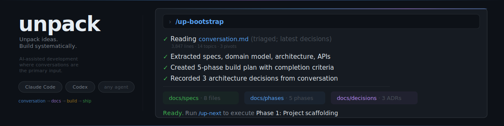
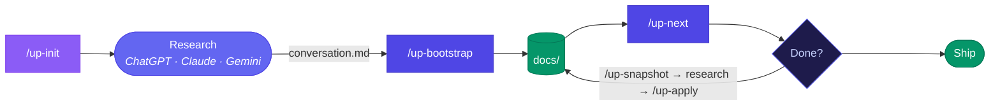

<p align="center">
  
</p>

<p align="center">
  <a href="LICENSE"></a>
  
  
  
</p>

<p align="center">
  <strong>Open-source framework for AI-assisted development where conversations are the primary input.</strong><br/>
  Research freely in ChatGPT, Claude, or any AI tool. Drop the conversation into your project.<br/>
  Let an AI coding agent decompress it into structured specs, phases, and execution plans.
</p>

---

## Quick start

All `/up-*` commands run inside your AI coding agent (Claude Code, Codex) — not the terminal.

1. **Use this template** on GitHub → clone → run `/up-init`
2. Research in any AI → save chat as `conversation.md`
3. `/up-bootstrap` → `/up-next` → build

> **Existing project?** Copy `AGENTS.md`, `CLAUDE.md`, `skills/`, `docs/`, `prompts/`, `standards/` into your repo and run `/up-adopt`.

## The problem

AI chat is incredible for exploring ideas — architecture, trade-offs, edge cases, technology choices. But conversations produce loose threads, not structured codebases. Meanwhile, AI coding agents (Codex, Claude Code) are great at executing well-defined tasks but struggle with ambiguous, open-ended instructions.

**Unpack bridges the gap.** It turns the messy, creative output of research conversations into the structured, phase-driven documentation that coding agents need to build reliably. And when you need to iterate, it extracts the current state back into a portable snapshot you can take to any AI for the next round of research.

## How it works



### Step by step

1. **Research freely** — Use any AI to explore your project idea. Any conversation format works — raw ChatGPT exports, meeting notes, brainstorm docs. For best results, paste the [research guide](prompts/research-guide.md) at the start to keep things structured.

2. **Drop a conversation** — Save the chat as `conversation.md` at your project root.

3. **Bootstrap** — Run `/up-bootstrap`. The agent reads the conversation, extracts specs, requirements, architecture decisions, and creates a phased build plan. The conversation is archived to `conversations/001-initial-design.md`.

4. **Build** — Run `/up-next` to execute phases one at a time. Each phase has clear scope, completion criteria, and tests. The agent follows the plan, not vibes.

5. **Iterate** — Need more research? Run `/up-snapshot` to export the current project state as a portable markdown file. Take it to ChatGPT with the [snapshot context](prompts/snapshot-context.md) prompt. When done, save the new conversation as `conversation.md` and run `/up-apply` to patch existing docs.

## Getting started

### New project (use as GitHub template)

1. Click **"Use this template"** on GitHub to create your repo
2. Clone it locally
3. Run `/up-init` — the wizard asks for your project name, license, stack, and docs preferences. It replaces the template README with yours and loads coding standards
4. Have a research conversation in ChatGPT (use [prompts/research-guide.md](prompts/research-guide.md))
5. Save the chat as `conversation.md` at the project root
6. Run `/up-bootstrap` to decompress into structured docs and phases
7. Run `/up-next` to start building

### Existing project (adopt)

1. Copy these into your repo: `AGENTS.md`, `CLAUDE.md`, `skills/`, `docs/`, `prompts/`, `standards/`
2. Run `/up-adopt` — the agent scans your codebase, generates discovery docs, and creates alignment phases
3. Run `/up-next` to start improving

### Upgrading Unpack

Since "Use this template" creates a disconnected copy, your project won't automatically get Unpack updates. To pull in new skills, standards, or improvements:

```bash
# Add the Unpack template as a remote (one-time)
git remote add unpack https://github.com/apresmoi/unpack.git

# Fetch and merge only the framework files
git fetch unpack
git checkout unpack/main -- skills/ prompts/ standards/ AGENTS.md CLAUDE.md
git add -A && git commit -m "Upgrade Unpack framework"
```

**What gets upgraded**: skills (`skills/`), prompts, standards, and agent instructions (`AGENTS.md`). Re-run `/up-init` to redeploy updated skills to your agent.

**What stays untouched**: your project docs (`docs/`), conversations, README, LICENSE, and any project-specific files.

Check the version in `AGENTS.md` (`UNPACK_VERSION` comment) to see what you're running.

## Skills

| Skill | When to use |
|-------|-------------|
| `/up-init` | Setting up a new project — stack, standards, and docs preferences |
| `/up-bootstrap` | Processing your first conversation into docs, specs, and phases |
| `/up-adopt` | Bringing Unpack into an existing codebase |
| `/up-status` | Checking project progress, blockers, and the next phase |
| `/up-next` | Executing the next phase |
| `/up-snapshot` | Exporting project state for external research |
| `/up-apply` | Applying a follow-up conversation to patch or steer existing docs |
| `/up-document` | Generating human-readable docs in `guide/` (supports Mintlify) |
| `/up-extract-standards` | Scanning a repo to extract coding standards |

## Working with conversations

### Any conversation format

Unpack accepts any conversation format — not just ones started with the research guide:

- **ChatGPT/Claude exports** started with the research guide (ideal — most structured)
- **Raw AI conversation** copy-paste (common — works fine)
- **Meeting notes**, brainstorm docs, or design discussions in any markdown format

The research guide is recommended because it produces the most structured input, but the agent will extract what it can from any format and mark gaps as open questions.

### Conversation versioning

Every conversation is preserved and numbered:

```
conversations/
  001-initial-design.md
  002-auth-iteration.md
  003-performance-steering.md
```

Your full research history is traceable. Every decision can be traced back to the conversation where it was made.

### Research tips

You don't need to be organized. Unpack is designed for how people actually think — messy, iterative, full of tangents. Here's how to get the most out of your research sessions:

**Start broad, narrow through conversation.** Don't plan the project before you research it. "I want to build something with real-time data" is a perfectly valid starting point. Let the conversation discover the project.

**Dump everything you're thinking.** Stream of consciousness works. Mix questions with constraints with half-formed ideas with existing code. The agent will sort it out.

> *"So I want a dashboard but maybe it should be a CLI? Also here's my current database schema. Oh and we need to support offline mode. Does this make sense?"*
>
> This is a valid research message. Don't clean it up.

**Pivot freely.** Started designing a recipe app and ended up designing a meal planning service? That's not wasted work — the early exploration informed the final direction. The agent knows to follow the latest decisions, not the first ones.

**Bring your existing work.** Drop your schemas, configs, API responses, error logs — anything that grounds the conversation in reality. The AI gives better answers when it can see what you already have.

**You don't have to read everything.** Ask the AI for summaries first. "Give me the 5-bullet version, then the full detail" is a great pattern. Skim the summaries, go deep only on what catches you.

**End with a consolidated dump.** Before closing the conversation, ask: "Summarize all decisions we made, open questions, and suggested build order." This gives the bootstrap agent the cleanest possible extraction target.

**One session = one conversation file.** Even if it's thousands of lines with multiple pivots. Keep it together so the agent sees the full reasoning arc. Unpack handles long conversations with a [triage protocol](#long-conversations) that indexes the content before extracting.

### Long conversations

For focused conversations, `/up-bootstrap` processes everything directly — even if they're thousands of lines long. For complex conversations (2000+ lines with multiple pivots or abandoned directions), it uses a two-pass **triage protocol**:

1. **Scan** — The agent reads the conversation in chunks and builds an index: topic timeline, pivot points, abandoned directions, and final decisions.
2. **Confirm** — The agent presents the conversation map to you. You confirm which directions matter and which were abandoned.
3. **Extract** — The agent deep-reads only the confirmed sections. For topics discussed multiple times, it takes the latest version. Meta-conversation (formatting tips, tangents) is skipped.
4. **Bootstrap** — Standard decomposition into specs, phases, and decisions.

This prevents the agent from drowning in 10,000-line conversations or creating specs for ideas you explored and dropped three pivots ago.

## Agent support

Unpack works with:

- **Claude Code** — via `CLAUDE.md` + `skills/` (deployed as slash commands during init)
- **Codex** — via `AGENTS.md` (reads instructions and follows procedures)

The system is agent-agnostic by design. `AGENTS.md` is the source of truth — any agent that reads markdown instructions can use it.

## Documentation structure

Unpack maintains two separate documentation layers:

- **`docs/`** — Agent docs. The source of truth for AI coding agents. Specs, phases, decisions, and memory.
- **`guide/`** — Human docs. Readable documentation for developers, stakeholders, and users. Optionally powered by [Mintlify](https://mintlify.com).

During `/up-init`, you choose your human docs preferences: whether to enable them, at what level (end-user, technical, or full), and whether to use Mintlify. Run `/up-document` at phase boundaries to generate or update the `guide/`.

### Agent docs (`docs/`)

```
docs/
  index.md                  # Navigation hub + phase status table
  _meta/
    workflow.md             # Operating principles
    adoption-rules.md       # Rules for adopting existing repos
    unpack-map.md           # How conversation topics map to spec files
    project-memory.md       # Decisions log (append-only)
    guide-config.md         # Human docs preferences (level, Mintlify)
  specs/                    # System truth
    00-overview.md          # Vision, goals, non-goals
    01-requirements.md      # Functional + non-functional requirements
    02-domain-model.md      # Entities, relationships, business rules
    03-architecture.md      # Components, boundaries, data flows
    04-apis-and-interfaces.md
    05-ux-and-flows.md
    06-testing-and-quality.md
    07-operations.md
    08-security-and-privacy.md
  phases/                   # Execution plan with dependencies
  decisions/                # Architecture Decision Records (ADRs)
  discovery/                # Facts derived from code scanning (adoption)
  practices/                # Coding standards loaded for this project
```

### Human docs (`guide/`)

```
guide/
  index.md                  # Table of contents
  getting-started.md        # Setup, install, run
  usage.md                  # How to use the product
  architecture.md           # System overview (technical level)
  api-reference.md          # API docs (technical level)
  configuration.md          # Environment variables, settings (technical level)
  deployment.md             # How to deploy (technical level)
  contributing.md           # How to contribute (full level)
  decisions.md              # Key decisions for humans (full level)
```

Not all files are generated — it depends on your configured documentation level. Generate at phase boundaries with `/up-document`, not after every tiny change.

## Standards library

Unpack ships with 15 coding standards covering common stacks. During `/up-init`, you select which ones apply to your project — they get copied into `docs/practices/`.

| Category | Standards |
|----------|-----------|
| **Universal** | File length limits (400 lines max) |
| **TypeScript** | General, React, Next.js, Express API |
| **TypeScript libraries** | Prisma, Tailwind, React Query, Zod |
| **Python** | General (poetry, ruff, mypy, pytest) |
| **Infrastructure** | AWS Copilot, Docker |
| **Organization** | Folder structure, agent-friendly patterns |

Standards are templates. Use `/up-extract-standards` to create new ones from your own repos.

## How is this different?

Spec-driven development (SDD) is a growing category — tools like GitHub Spec Kit, BMAD, and Amazon Kiro all structure AI coding agent work around specifications. Unpack shares the spec-first philosophy but differs in where the spec comes from: **conversations, not prompts.**

Most SDD tools start from a developer-written spec or an AI-prompted one. Unpack starts from the messy, creative research conversation you already had — and decompresses it into structured docs. It also formalizes the loop back: snapshot your project state, take it to any AI for more research, and apply the findings.

```
                    Conversation input
                    No              Yes
                ┌───────────┬───────────┐
  Heavyweight   │ BMAD      │           │
  (complex)     │ Kiro      │  (empty)  │
                │ Tessl     │           │
                ├───────────┼───────────┤
  Lightweight   │ Spec Kit  │  Unpack   │
  (simple)      │ OpenSpec  │           │
                │ Task Mstr │           │
                └───────────┴───────────┘
```

## Philosophy

**Research freely, build systematically.** Unpack doesn't constrain how you think about your project. Use any AI, any conversation style, any level of exploration. But when it's time to build, every line of code traces back to a spec, every spec traces back to a phase, and every phase has clear completion criteria.

**Conversations are first-class artifacts.** They're versioned, referenced, and preserved. The full reasoning behind every decision is always recoverable.

**Phases drive work.** No hidden scope. No untracked changes. If something material changes mid-build, it becomes a steering phase with explicit impacts and updated dependencies.

**Docs are the truth.** Code follows docs, not the other way around. When reality diverges from documentation, the docs get updated first, then the code follows.

**AI does the thinking cheaply, agents do the building systematically.** Web-based AI (ChatGPT, Claude, Gemini) is free or near-free, with powerful research capabilities like deep research and hour-long reasoning. Coding agents consume tokens. Unpack puts the expensive execution behind structured plans, and the creative exploration where it's cheap.

## License

[MIT](LICENSE)
